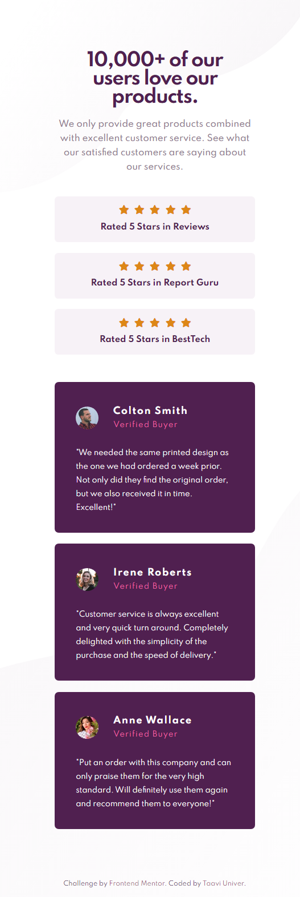
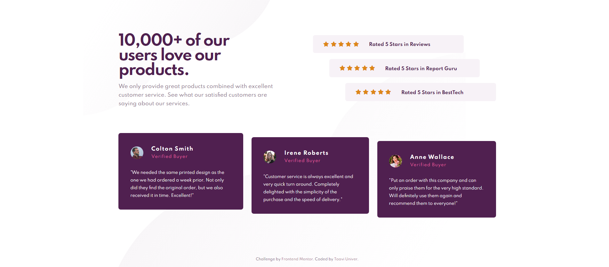

# Frontend Mentor - Social proof section solution

This is a solution to the [Social proof section challenge on Frontend Mentor](https://www.frontendmentor.io/challenges/social-proof-section-6e0qTv_bA). Frontend Mentor challenges help you improve your coding skills by building realistic projects. 

### Screenshot

Mobile view:

Desktop view:

### Links

- Solution URL: https://www.frontendmentor.io/solutions/socialproofsection-A5ys1SUEY
- Live Site URL: https://taavi-univer.github.io/social-proof-section/

### Built with

- HTML5
- CSS
- Flexbox
- Mobile-first workflow

## Author

- Website - https://github.com/Taavi-Univer?tab=repositories
- Frontend Mentor - https://www.frontendmentor.io/profile/Taavi-Univer
