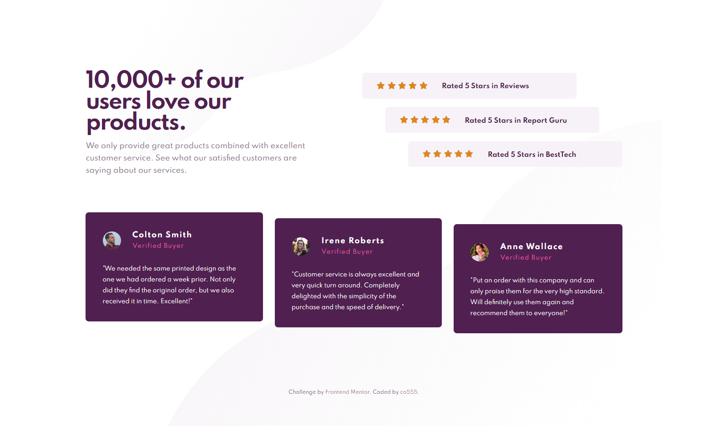
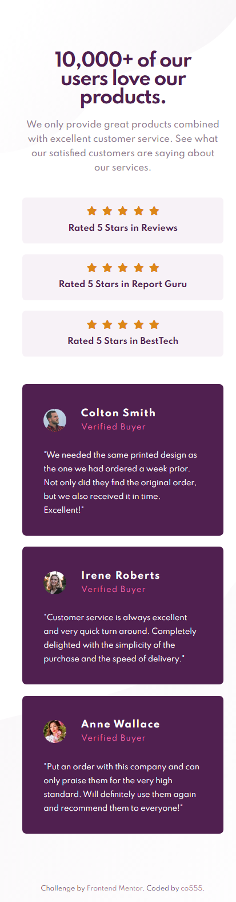

# Frontend Mentor - Social proof section solution

This is a solution to the [Social proof section challenge on Frontend Mentor](https://www.frontendmentor.io/challenges/social-proof-section-6e0qTv_bA). Frontend Mentor challenges help you improve your coding skills by building realistic projects. 

## Table of contents

- [Overview](#overview)
  - [The challenge](#the-challenge)
  - [Screenshot](#screenshot)
  - [Links](#links)
- [My process](#my-process)
  - [Built with](#built-with)
- [Author](#author)

## Overview

### The challenge

Users should be able to:

- View the optimal layout for the section depending on their device's screen size

### Screenshot

Desktop view:

Mobile view:

### Links

- Solution URL: https://www.frontendmentor.io/solutions/socialproofsection-A5ys1SUEY
- Live Site URL: https://co555.github.io/social-proof-section/

## My process

### Built with

- Mobile-first workflow
- Flexbox

## Author

- Website - https://github.com/co555?tab=repositories
- Frontend Mentor - https://www.frontendmentor.io/profile/co555
